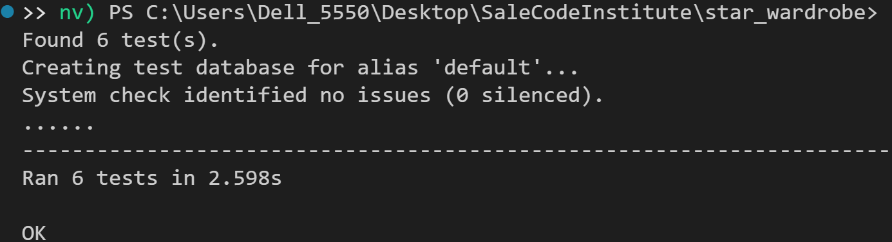

# **Star WarDrobe**

## **Project Overview**

Welcome to **Star WarDrobe**, an e-commerce platform offering exclusive Star Wars merchandise, including toys, clothing, and action figures. This project was created as part of a Django Full-Stack Development course, adhering to agile methodologies.

Star WarDrobe combines advanced functionality with a Star Wars-inspired design, delivering a unique shopping experience for fans of the galaxy far, far away.

**E-Commerce Business Model**

The e-commerce platform operates on a B2C (Business-to-Consumer) model, selling officially licensed Star Wars merchandise directly to fans and collectors. The target audience includes Star Wars enthusiasts of all ages, from casual fans to dedicated collectors. 

**Revenue Streams:**
- Product sales, including toys, apparel, and clothing.
- Limited-edition and exclusive merchandise targeting collectors.
- Cross-selling opportunities through bundles and discounts.

**Value Proposition:**
- Authentic Star Wars merchandise guaranteed for quality and originality.
- A seamless user experience with intuitive navigation, secure checkout, and responsive design.
- Exclusive deals and new product launches announced via newsletters and social media.

This business model emphasizes a fan-first approach by building trust and creating an enjoyable shopping experience.


---

## Table Of Contents:
1. [User Stories](#user-stories)
2. [Features](#features)
3. [Wireframes and Mockups](#wireframes-and-mockups)
4. [Future Features](#future-features)
5. [Bugs and Fixes](#bugs-and-fixes)
6. [Technologies Used](#technologies-used)
7. [Database Schema](#database-schema)
8. [Testing](#testing)
9. [Deployment](#deployment)
10. [Credits](#credits)

---

## **User Stories**

User stories define the functionality and features of the Star WarDrobe from the end-users' perspective:

- As a Developer, I want to set up Django and install the supporting libraries, so that I am ready to start development.
- As a User, I want to have a smooth browsing experience across devices, so that I can easily navigate the site on any screen size.
- As a User, I want to see a custom 404 error page, so that I have a better experience when encountering broken links.
- As a Marketer, I want to implement meta tags and descriptive titles for SEO, so that our site ranks better in search results.
- As a Developer, I want to deploy the site to Heroku early, so that I can start testing in a production-like environment.
- As a Developer, I want to finalize deployment, so that the site is live and functional for users.
- As a Customer, I want to browse products easily, so that I can find items to buy.
- As a Customer, I want to add products to a shopping cart, so that I can review and purchase them.
- As a Site Admin, I want to add meta tags and SEO-friendly content, so that the site ranks higher in search engines. 
- As a User, I want to register and log in to the site, so that I can save my shopping cart and make purchases. 
- As a Developer, I want to keep the secret keys secure, so that they are not exposed in the code repository.
- As a Customer, I want to add products to a wishlist, so that I can save items for future purchase.
- As a User, I want to easily navigate the site with a clear menu, so that I can find products and information faster.
- As a Developer, I want to write and run tests for my application, so that I can ensure it is bug-free and functional.
- As a Customer, I want to save my credit card details securely, so that I can make faster purchases in the future.
- As a Customer, I want to sign up for a newsletter, so that I can get updates about new products.
- As a Customer, I want to see links to social media pages, so that I can follow the brand online.
- As a Customer, I want to checkout and complete the purchase, so that I can pay for the items in my cart.

---

## **Features**

### **1. Core Features**
- **User Authentication**:  
  Users can register, log in, log out, and manage their profiles.
  
- **Product Management**:  
  Products are categorized into toys, clothing, and action figures. Admin users can add, edit, and delete products.
  
- **Shopping Bag**:  
  Users can add items to their bag, adjust quantities, and view the total price.
  
- **Checkout System**:  
  Integrated with Stripe for secure payments, allowing users to place orders and receive confirmation emails.
  

### **2. Design and Theming**
- **Star Wars-Themed Design**:  
  The site uses a black and gold color scheme with space-themed backgrounds, and a "galactic" look.  
- **Custom 404 Page**:  
  A Star Wars-inspired 404 error page with fun references to the galaxy far, far away.  

### **3. Marketing Features**
- **Newsletter Signup**:  
  Users can subscribe to receive updates about new products and offers.
  
  
- **Social Media Integration**:  
  Links to a mockup Star WarDrobe Facebook page for digital marketing. 
   
  
- **SEO Optimization**:  
  Includes metadata, keywords, and Open Graph tags for better discoverability.  

### **4. Agile Methodology**
- **Epics and User Stories**:  
  The project was built using an agile approach, with epics and user stories created to guide development.  
- **Kanban Board**:  
  Tasks were tracked on a Trello board to ensure efficient project management.
  

---

## **Wireframes and Mockups**

The following wireframes were created during the design phase to visualize the layout and structure of the website.

### **Homepage**

+----------------------------------------------------+
| STAR WAR DROBE        [ Search Bar ]  [ Cart $0 ] |
+----------------------------------------------------+
| [ ALL PRODUCTS ] [ REBEL APPAREL ] [ STAR WARS TOYS ] [ SPECIAL OFFERS ] |
+----------------------------------------------------+
| FREE DELIVERY ON ORDERS OVER $50!                 |
+----------------------------------------------------+
|     THE NEW COLLECTIONS ARE HERE                  |
|    +----------------------------------+           |
|    |         [ SHOP NOW ]             |           |
|    +----------------------------------+           |
|                                                  |
|          [ Darth Vader Hero Image ]             |
|                                                  |
+----------------------------------------------------+
| [ Subscribe to our Newsletter ]                  |
| [ Follow us on Facebook ]                        |
+----------------------------------------------------+


The homepage was designed to showcase featured products, a search bar, and a navigation menu for easy access.

### **Product Page**

+----------------------------------------------------+
| STAR WAR DROBE       [Search Bar]   My Account $0 |
+----------------------------------------------------+
| [ALL PRODUCTS]  [REBEL APPAREL]  [STAR WARS TOYS] |
|                 [SPECIAL OFFERS]                  |
+----------------------------------------------------+
|      FREE DELIVERY ON ORDERS OVER $50!           |
+----------------------------------------------------+

+----------------------------------------------------+
| [ Darth Vader Action Figure ]  [ Obi-Wan Figure ] |
|        $77.00                      $67.00        |
| [ Yoda Figure ]               [ Obi-Wan Cloak ]  |
|    $46.00                          $47.00        |
+----------------------------------------------------+
| Sort by: [ Dropdown ]                             |
+----------------------------------------------------+


The product page focuses on displaying a detailed view of each item with an "Add to Cart" button.

### **Cart Page**

+------------------------------------------------------+
|                   SHOPPING BAG                       |
+------------------------------------------------------+
| Product Info       | Price   | Qty   | Subtotal     |
+------------------------------------------------------+
| [Darth Vader Img]  | $77.00  | [ - 1 + ] | $77.00 |
| Darth Vader Action Figure                            |
| Size: N/A | SKU: ACT002                              |
| Update | Remove                                     |
+------------------------------------------------------+
| [Yoda Img]        | $46.00  | [ - 1 + ] | $46.00  |
| Yoda Action Figure                                  |
| Size: N/A | SKU: ACT005                              |
| Update | Remove                                     |
+------------------------------------------------------+
| Bag Total: $123.00                                  |
| Delivery: $0.00                                     |
| Grand Total: $123.00                                |
+------------------------------------------------------+
| [ ◀ KEEP SHOPPING ]   [ SECURE CHECKOUT 🔒 ]         |
+------------------------------------------------------+
| Subscribe to our Newsletter                         |
| Follow us on Facebook                               |
+------------------------------------------------------+


The cart page provides a summary of the user's selected items and allows them to proceed to checkout.

### **Checkout Page**

+------------------------------------------------------+
|                  STAR WAR DROBE                      |
+------------------------------------------------------+
| [Search Bar]  🔍    [ My Account ]   [Cart: $226.00]|
+------------------------------------------------------+
| [ ALL PRODUCTS ] [ REBEL APPAREL ] [ STAR WARS TOYS ] |
| [ SPECIAL OFFERS ]                                    |
+------------------------------------------------------+
|       FREE DELIVERY ON ORDERS OVER $50!             |
+------------------------------------------------------+
|                DETAILS                               |
| Full Name *   [__________________________]         |
| Email Address * [________________________]         |
+------------------------------------------------------+
|                  DELIVERY DETAILS                    |
| Phone Number *  [__________________________]        |
| Street Address 1 * [________________________]       |
| Street Address 2 [_________________________]       |
| Town or City *  [__________________________]        |
| County, State or Locality [_________________]       |
| Postal Code     [__________________________]        |
| Country *       [__________________________] ⌄      |
| [ Create an account or login to save this info ]    |
+------------------------------------------------------+
|                  ORDER SUMMARY                       |
| [Darth Vader Img] Darth Vader Action Figure        |
| Size: N/A  Qty: 1                                  |
| Item 1 Price: $56.00                               |
| Item 2 Price: $47.00                               |
| --------------------------------------------------- |
| Order Total:  $226.00                              |
| Delivery:     $0.00                                |
| Grand Total:  $226.00                              |
+------------------------------------------------------+
|                  PAYMENT DETAILS                     |
| [ Card Number ] [ Autofill link ]                   |
+------------------------------------------------------+


The checkout page includes fields for delivery details and payment information, with a final order summary.


---

## **Future Features**

### 1. **Social Login Options**
- **Facebook and Googlw Integration**:
  Integrate Facebook and Google login via allauth

---

## **Bugs and Fixes**

### **Resolved Bugs**
1. **Duplicate Index URL Error**:  
   Fixed a conflict in URL patterns.

2. **Static Files Issue on Heroku**:  
   Resolved by configuring Whitenoise for static file management and ensuring correct static file paths.

3. **Search Bar Misalignment**:  
   Adjusted the Bootstrap grid system to fix alignment issues in the search bar on mobile devices.

4. **File Structure**:
   Fixed file structure by moving folders 1 directory up.

5. **Stripe bad API Key**
   Rolled new Stripe secret key and insert in Config Vars on Heroku.

---

## **Technologies Used**

### **Backend**
- **[Python](https://www.python.org/):** Programming language used for backend development.
- **[Django](https://www.djangoproject.com/):** Python-based web framework.
- **[SQLite](https://www.sqlite.org/):** Database used (for development).
- **[PostgreSQL](https://www.postgresql.org/):** Database used (for production).

### **Frontend**
- **[HTML](https://en.wikipedia.org/wiki/HTML):** Markup language for creating web pages.
- **[CSS](https://en.wikipedia.org/wiki/CSS):** Style sheet language for designing web pages.
- **[Bootstrap](https://getbootstrap.com/):** CSS framework for responsive design.
- **[JavaScript](https://en.wikipedia.org/wiki/JavaScript):** Programming language for interactive web elements.(jQuery and custom scripts)

### **Other Tools and Libraries**
- **[AWS](https://aws.amazon.com/):**: Cloud storage service used for managing media files.
- **[Stripe](https://stripe.com/ie):**: Payment gateway for processing transactions.
- **[Mailchimp](https://mailchimp.com/):** Email marketing platform for managing newsletters, email campaigns, and subscriber lists.
- **[Django-Allauth](https://docs.allauth.org/en/latest/):**: Authentication application for user registration, login,
     and account management.
- **[Whitenoise](https://whitenoise.readthedocs.io/en/stable/django.html):**: Simplifies serving static files in production.
- **[FontAwesome](https://fontawesome.com/):**: For icons.
- **[Google-Fonts](https://fonts.google.com/):**: For custom typography.
- **[GitHub](https://github.com/):** Version control and collaboration platform.
- **[Heroku](https://www.heroku.com/):** Platform as a service (PaaS) used for deploying the application.
- **[Gunicorn](https://gunicorn.org/):** WSGI HTTP server used for deploying Django applications.

---

## Database Schema

### Products App

- **Category**  
  - `id` (Primary Key)  
  - `name` (CharField)  
  - `friendly_name` (CharField)  

- **Product**  
  - `id` (Primary Key)  
  - `category` (ForeignKey → Category)  
  - `sku` (CharField)  
  - `name` (CharField)  
  - `description` (TextField)  
  - `has_sizes` (BooleanField)  
  - `price` (DecimalField)  
  - `rating` (DecimalField)  
  - `image_url` (URLField)  
  - `image` (ImageField)  

- **Wishlist**  
  - `user` (OneToOneField → User)  
  - `products` (ManyToManyField → Product)  

- **ProductReview**  
  - `id` (Primary Key)  
  - `product` (ForeignKey → Product)  
  - `user` (ForeignKey → User)  
  - `review_text` (TextField)  
  - `rating` (IntegerField)  
  - `created_at` (DateTimeField)  

- **DiscountCode**  
  - `id` (Primary Key)  
  - `code` (CharField, unique)  
  - `discount_percentage` (DecimalField)  
  - `valid_from` (DateTimeField)  
  - `valid_to` (DateTimeField)  
  - `active` (BooleanField)  

---

## **Testing**

### PEP8 Testing Screenshots

### **Note :** Much of the code was left as it is because it got broken


### Lighthouse Testing Screenshots


### Manual Testing

| Feature                  | Test Performed                                                                                  | Result  |
|--------------------------|-------------------------------------------------------------------------------------------------|---------|
| **User Registration**    | Users can register a new account and receive an email confirmation for activation.              | Pass    |
| **User Login**           | Registered users can log in to access their profile and dashboard.                              | Pass    |
| **Profile Update**       | Users can update their delivery details and contact information in their profile.               | Pass    |
| **View Products**        | Users can view all products with details like name, price, description, and image.              | Pass    |
| **Add to Cart**          | Users can add products to the shopping cart and view updated totals.                            | Pass    |
| **Remove from Cart**     | Users can remove items from the shopping cart, and totals update accordingly.                   | Pass    |
| **Checkout**             | Users can enter delivery details, view order summaries, and complete purchases via Stripe.      | Pass    |
| **Order History**        | Users can view past orders with details like order number, date, and total cost.                | Pass    |
| **Search Functionality** | Users can search for products using keywords or filter products by category.                    | Pass    |
| **Newsletter Signup**    | Users can enter their email address and successfully subscribe to the newsletter.               | Pass    |
| **Social Media Links**   | Users can access the store’s Facebook page through a link in the footer.                        | Pass    |
| **Responsiveness**       | The app layout adjusts correctly for desktop, tablet, and mobile screen sizes.                  | Pass    |

### **Automated Testing**  
Automated tests were created using Django’s built-in test framework. The tests include:  

#### **📌 Models Testing**  
- Ensures that product and category models store and retrieve data correctly.  
- Validates that default values and field constraints are properly enforced.  

#### **📌 Views Testing**  
- Confirms that pages return the correct HTTP response (200 OK or 302 Redirect).  
- Verifies that views render the expected templates.  
- Ensures that user authentication is required for certain views.  

#### **📌 Forms Testing**  
- Validates that forms correctly process and sanitize user inputs.  
- Checks if form submissions with invalid data return errors as expected.  

#### **📌 URLs Testing**  
- Ensures that URLs correctly resolve to their respective views.  
- Confirms that protected routes require authentication.  

#### **📌 Running Automated Tests**  
To execute the automated tests, run the following command in the terminal:  

python manage.py test

✅ All tests passed successfully! 🚀
📌 Test Results Screenshot
Below is a screenshot of the automated test results:



---

## **Installation Instructions**

1. Clone the repository:  
   ```bash
   git clone https://github.com/Salewitcher/star-wardrobe.git
   cd star-wardrobe

# Deployment
The project was developed using a VS Code workspace. The code was committed to Git and pushed to GitHub using the terminal. The web application is deployed on Heroku as GitHub Pages is not able to host a Python project. Static and media files are being stored in AWS S3. The repository is hosted on GitHub.

## How To Use This Project
To use and further develop this project you can either fork or clone the repository.

### Fork GitHub Repository
By forking the GitHub repository you can make a copy of the original repository on your GitHub account to view and/or make changes without affecting the original repository, by using the following steps:

1. Log in to GitHub.
2. Navigate to the main page of the GitHub Repository that you want to fork.
3. At the top right of the Repository just below your profile picture, locate the "Fork" button.
4. You should now have a copy of the original repository in your GitHub account.
5. Changes made to the forked repository can be merged with the original repository via a pull request.

### Clone GitHub Repository
By cloning a GitHub repository you can create a local copy on your computer of the remote repository. The developer who clones a repository can synchronize their copy of the codebase with any updates made by fellow developers with push or pull requests. Cloning is done by using the following steps:

1. Log in to GitHub.
2. Navigate to the main page of the GitHub Repository that you want to clone.
3. Above the list of files, click the dropdown called "Code".
4. To clone the repository using HTTPS, under "HTTPS", copy the link.
5. Open Git Bash.
6. Change the current working directory to the location where you want the cloned directory to be made.
7. Type `git clone`, and then paste the URL you copied in Step 4.

```bash
$ git clone https://github.com/YOUR-USERNAME/YOUR-REPOSITORY
```

8. Press Enter. Your local clone will be created.

```bash
$ git clone https://github.com/YOUR-USERNAME/YOUR-REPOSITORY
> Cloning into `CI-Clone`...
> remote: Counting objects: 10, done.
> remote: Compressing objects: 100% (8/8), done.
> remote: Total 10 (delta 1), reused 10 (delta 1)
> Unpacking objects: 100% (10/10), done.
```

Changes made on the local machine (cloned repository) can be pushed to the upstream repository directly if you have write access to the repository. Otherwise, the changes made in the cloned repository are first pushed to the forked repository, and then a pull request is created.

Click [here](https://docs.github.com/en/github) to retrieve pictures for some of the buttons and more detailed explanations of the above process.

## Project Set Up After Forking or Cloning

1. Install all dependencies by typing in the CLI:
   ```bash
   pip3 install -r requirements.txt
   ```
2. Create a `.gitignore` file and `env.py` file in the project's root directory. Add the `env.py` file to `.gitignore`.
3. Inside the `env.py` file, enter the project's environment variables:

   ```python
   import os
   os.environ.setdefault("SECRET_KEY", "<your_secret_key>")
   os.environ.setdefault("DEVELOPMENT", '1')
   os.environ.setdefault("STRIPE_PUBLIC_KEY", "<your_key>")
   os.environ.setdefault("STRIPE_SECRET_KEY", "<your_key>")
   os.environ.setdefault("STRIPE_WH_SECRET", "<your_key>")
   ```

4. You can get the keys from:
   - "SECRET_KEY" can be generated using [Django Secret Key Generator](https://djecrety.ir/)
   - "STRIPE_PUBLIC_KEY" and "STRIPE_SECRET_KEY" can be generated by creating a [Stripe](https://stripe.com/) account. The keys are found in the 'Developers' section under 'API Keys'.
   - In the Developer Section, under 'Webhooks', add a new endpoint for "STRIPE_WH_SECRET". On Endpoint URL, enter:
     ```
     https://<your_host_url>/checkout/wh/
     ```
   - Select to listen to all events, create the endpoint, and retrieve your "STRIPE_WH_SECRET".

5. Make migrations to set up the initial database operations:
   ```bash
   python3 manage.py makemigrations
   python3 manage.py migrate
   ```
6. Load data for the database or create data manually:
   ```bash
   python3 manage.py loaddata <app_name>
   ```
7. Create a superuser:
   ```bash
   python3 manage.py createsuperuser
   ```
8. The project should now be ready for development. To run the project, type in the CLI terminal:
   ```bash
   python3 manage.py runserver
   ```

   # Deployment to Heroku

This project is deployed on Heroku for production, with all static and media files stored on AWS S3. These are steps to deploy on Heroku:

1. Navigate to Heroku.com, create a new account or login if you already have an account. On the dashboard page, click "Create New App" button. Give the app a name, the name must be unique with hyphens between words. Set the region closest to you, and click "Create App".
2. On the resources tab, provision a new Heroku Postgres database.
3. Configure variables on Heroku by navigating to Settings, and click on Reveal Config Vars. You may not have all the values yet. Add the others as you progress through the steps.

### Variables
| Key | Value |
|------|------|
| AWS_ACCESS_KEY_ID | your_access_key_id_from_AWS |
| AWS_SECRET_ACCESS_KEY | your_secret_access_key_from_AWS |
| DATABASE_URL | your_database_url |
| EMAIL_HOST_PASS | your_app_password_from_your_email |
| EMAIL_HOST_USER | your_email_address |
| SECRET_KEY | your_secret_key |
| STRIPE_PUBLIC_KEY | your_stripe_public_key |
| STRIPE_SECRET_KEY | your_stripe_secret_key |
| USE_AWS | True |

4. If you haven't installed it, install `dj_database_url` and `psycopg2`:
```sh
pip3 install dj_database_url
pip3 install psycopg2-binary
```
Note: You don't have to do this if you've installed all dependencies in the `requirements.txt` file.

5. Set up a new database for the site by going to the project's `settings.py` and importing `dj_database_url`. Comment out the database's default configuration, and replace it with:
```python
DATABASES = {
  'default': dj_database_url.parse('YOUR_DATABASE_URL_FROM_HEROKU')
}
```

6. Run migrations:
```sh
python3 manage.py migrate
```

7. Import data to the database:
```sh
./manage.py dumpdata --exclude auth.permission --exclude contenttypes > db.json
```
Switch to the Postgres database, then load the data:
```sh
./manage.py loaddata db.json
```

8. Set up a new superuser:
```sh
python3 manage.py createsuperuser
```

9. Update `settings.py` to use Postgres on Heroku and SQLite locally:
```python
if 'DATABASE_URL' in os.environ:
   DATABASES = {
      'default': dj_database_url.parse(os.environ.get('DATABASE_URL'))
   }
else:
   DATABASES = {
      'default': {
         'ENGINE': 'django.db.backends.sqlite3',
         'NAME': BASE_DIR / 'db.sqlite3',
      }
   }
```

10. Install Gunicorn:
```sh
pip3 install gunicorn
pip3 freeze > requirements.txt
```

11. Create a `Procfile` with the following content:
```sh
web: gunicorn shoes_and_more.wsgi:application
```

12. Login to Heroku CLI and disable collectstatic temporarily:
```sh
heroku login
heroku config:set DISABLE_COLLECTSTATIC=1 --app shoes-and-more
```

13. Update `ALLOWED_HOSTS` in `settings.py`:
```python
ALLOWED_HOSTS = ['shoes-and-more.herokuapp.com', 'localhost']
```

14. Add, commit, and push to GitHub, then deploy to Heroku:
```sh
git add .
git commit -m "Deploy to Heroku"
git push origin main
heroku git:remote -a shoes-and-more
git push heroku main
```

15. Connect Heroku to GitHub via the Heroku dashboard:
   - Navigate to the app's dashboard on Heroku.
   - Click on Deploy.
   - Connect the app to GitHub by searching for the repository and clicking "Connect".
   - Enable automatic deployment by clicking "Enable Automatic Deploys".

16. Update `SECRET_KEY` in `settings.py`:
```python
SECRET_KEY = os.environ.get('SECRET_KEY', '')
```

17. Set `DEBUG` to True only when the development environment variable exists:
```python
DEBUG = 'DEVELOPMENT' in os.environ
```

# AWS Bucket Creation and Integration

All static and media files in this project are stored in an Amazon Web Services (AWS) S3 bucket, a cloud-based storage service. Follow these steps to create and configure your own bucket and integrate it with Django.

---

## **1. Create an AWS S3 Bucket**

1. **Sign in to AWS**
   - Go to [AWS](https://aws.amazon.com/) and create an account or log in.
   
2. **Create an S3 Bucket**
   - Navigate to the AWS Management Console and search for "S3."
   - Click **Create Bucket**.
   - Choose a **unique name** (preferably matching your Heroku app name) and select the region closest to you.

3. **Configure Bucket Settings**
   - Under **Object Ownership**, select **ACLs enabled** and **Bucket Owner Preferred**.
   - **Uncheck** "Block all public access".
   - Check "I acknowledge that the current settings might result in this bucket and the objects within becoming public".
   - Click **Create Bucket**.

4. **Enable Static Website Hosting**
   - Click on your bucket and go to the **Properties** tab.
   - Scroll to **Static Website Hosting**, click **Edit**, and enable it.
   - Select **Host a Static Website**.
   - Set the **Index document** to `index.html` and the **Error document** to `error.html`.
   - Click **Save Changes**.

5. **Configure Permissions**
   - **Set CORS Configuration:**
     - Go to the **Permissions** tab, scroll to **CORS Configuration**, and click **Edit**.
     - Add the following JSON:
       ```json
       [
          {
             "AllowedHeaders": ["Authorization"],
             "AllowedMethods": ["GET"],
             "AllowedOrigins": ["*"],
             "ExposeHeaders": []
          }
       ]
       ```
     - Click **Save Changes**.
   
   - **Set Bucket Policy:**
     - Under **Bucket Policy**, click **Edit**, then open **Policy Generator**.
     - Set:
       - **Type of Policy:** S3 Bucket Policy
       - **Effect:** Allow
       - **Principal:** `*`
       - **Actions:** `s3:GetObject`
       - **ARN:** Use your bucket ARN (found in Bucket Policy settings).
     - Click **Add Statement** → **Generate Policy**.
     - Copy the generated policy and paste it into the **Bucket Policy Editor**.
     - Modify the `Resource` key as:
       ```json
       "Resource": "arn:aws:s3:::YOUR_BUCKET_NAME/*"
       ```
     - Click **Save**.
   
   - **Modify ACL (Access Control List):**
     - Scroll to **Access Control List (ACL)**.
     - Click **Edit** and enable **List** for "Everyone (public access)".
     - Accept the warning and save changes.

---

## **2. Create an IAM User for S3 Access**

1. **Navigate to IAM (Identity and Access Management)**
   - Open AWS Console → Search for "IAM" → Open it.

2. **Create a User Group**
   - Go to **User Groups** → Click **Create Group**.
   - Enter a name (e.g., `manage-starwardrobe`) → Click **Create Group**.

3. **Create an Access Policy**
   - Go to **Policies** → Click **Create Policy**.
   - Select **JSON** and import the **AmazonS3FullAccess** policy.
   - Modify the policy to limit access to your specific bucket:
     ```json
     "Resource": [
        "arn:aws:s3:::YOUR_BUCKET_NAME",
        "arn:aws:s3:::YOUR_BUCKET_NAME/*"
     ]
     ```
   - Click **Next: Tags** → **Next: Review**.
   - Name the policy and click **Create Policy**.

4. **Attach Policy to the User Group**
   - Go to **User Groups**, select your group.
   - Navigate to **Permissions** → **Attach Policies**.
   - Select the policy created earlier and click **Add Permissions**.

5. **Create an IAM User**
   - Go to **Users** → Click **Add Users**.
   - Set a username and **enable Programmatic Access**.
   - Click **Next: Permissions**, attach the user to the group created earlier.
   - Click **Create User** and **Download the CSV file** (contains AWS credentials).

---

## **3. Connect Django to AWS S3**

### **Install Dependencies**
```bash
pip3 install boto3 django-storages
pip3 freeze > requirements.txt
```

### **Update Django Settings**
1. **Add `storages` to `INSTALLED_APPS` in `settings.py`**

2. **Configure AWS Storage (in `settings.py`)**
```python
if 'USE_AWS' in os.environ:
    # Cache control
    AWS_S3_OBJECT_PARAMETERS = {
        'Expires': 'Thu, 31 Dec 2099 20:00:00 GMT',
        'CacheControl': 'max-age=94608000',
    }

    # Bucket Config
    AWS_STORAGE_BUCKET_NAME = 'YOUR_BUCKET_NAME'
    AWS_S3_REGION_NAME = 'YOUR_REGION'
    AWS_ACCESS_KEY_ID = os.environ.get('AWS_ACCESS_KEY_ID')
    AWS_SECRET_ACCESS_KEY = os.environ.get('AWS_SECRET_ACCESS_KEY')
    AWS_S3_CUSTOM_DOMAIN = f'{AWS_STORAGE_BUCKET_NAME}.s3.amazonaws.com'

    # Static & Media files
    STATICFILES_STORAGE = 'custom_storages.StaticStorage'
    STATICFILES_LOCATION = 'static'
    DEFAULT_FILE_STORAGE = 'custom_storages.MediaStorage'
    MEDIAFILES_LOCATION = 'media'

    # Override static & media URLs
    STATIC_URL = f'https://{AWS_S3_CUSTOM_DOMAIN}/{STATICFILES_LOCATION}/'
    MEDIA_URL = f'https://{AWS_S3_CUSTOM_DOMAIN}/{MEDIAFILES_LOCATION}/'
```

3. **Set Config Vars on Heroku**
   - Navigate to **Settings** → **Reveal Config Vars**.
   - Add:
     | Variable               | Value |
     |------------------------|----------------------------------------|
     | AWS_ACCESS_KEY_ID      | Your Access Key ID from CSV file      |
     | AWS_SECRET_ACCESS_KEY  | Your Secret Access Key from CSV file  |
     | USE_AWS                | `True` |
   - **Remove `DISABLE_COLLECTSTATIC`** from Config Vars.

4. **Create `custom_storages.py` in the project root**
```python
from django.conf import settings
from storages.backends.s3boto3 import S3Boto3Storage

class StaticStorage(S3Boto3Storage):
    location = settings.STATICFILES_LOCATION

class MediaStorage(S3Boto3Storage):
    location = settings.MEDIAFILES_LOCATION
```

5. **Commit and Push Changes**
```bash
git add .
git commit -m "Connected Django to AWS S3"
git push
```

---

Following these steps ensures that Django properly integrates with AWS S3 for static and media file storage. Let me know if you need further assistance! 🚀

---

## **Credits**

### **Content**
- Product descriptions inspired by Star Wars lore, focusing on themes, characters, and iconic elements from the franchise.  

### **Fonts**
- Google Fonts for custom typography, enhancing the Star Wars-inspired design.  


## **Acknowledgments**

- **Code Institute**: For the Django e-commerce course and guidance.  
- **OpenAI ChatGPT**: For brainstorming ideas and resolving technical issues.
- **Matt Bodden**: For mentorship, guidance, and providing valuable feedback throughout the project development process.

## **Code References**

- **Stripe Integration**: Based on the Boutique Ado walkthrough provided by Code Institute.  
- **Star Wars Theming**: Inspired by various online design tutorials and resources.  
