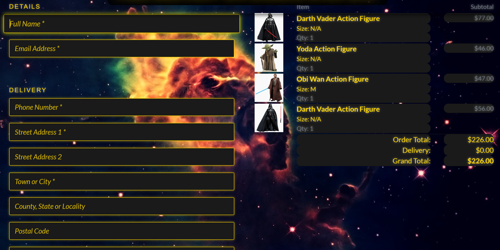

# **Star WarDrobe**

## **Project Overview**

Welcome to **Star WarDrobe**, an e-commerce platform offering exclusive Star Wars merchandise, including toys, clothing, and action figures. This project was created as part of a Django Full-Stack Development course, adhering to agile methodologies.

Star WarDrobe combines advanced functionality with a Star Wars-inspired design, delivering a unique shopping experience for fans of the galaxy far, far away.

**E-Commerce Business Model**

The e-commerce platform operates on a B2C (Business-to-Consumer) model, selling officially licensed Star Wars merchandise directly to fans and collectors. The target audience includes Star Wars enthusiasts of all ages, from casual fans to dedicated collectors. 

**Revenue Streams:**
- Product sales, including toys, apparel, and clothing.
- Limited-edition and exclusive merchandise targeting collectors.
- Cross-selling opportunities through bundles and discounts.

**Value Proposition:**
- Authentic Star Wars merchandise guaranteed for quality and originality.
- A seamless user experience with intuitive navigation, secure checkout, and responsive design.
- Exclusive deals and new product launches announced via newsletters and social media.

This business model emphasizes a fan-first approach by building trust and creating an enjoyable shopping experience.


---

## Table Of Contents:
1. [User Stories](#user-stories)
2. [Features](#features)
3. [Wireframes and Mockups](#wireframes-and-mockups)
4. [Future Features](#future-features)
5. [Bugs and Fixes](#bugs-and-fixes)
6. [Technologies Used](#technologies-used)
7. [Database Schema](#database-schema)
8. [Testing](#testing)
9. [Deployment](#deployment)
10. [Credits](#credits)

---

## **User Stories**

User stories define the functionality and features of the Star WarDrobe from the end-users' perspective:

- As a Developer, I want to set up Django and install the supporting libraries, so that I am ready to start development.
- As a User, I want to have a smooth browsing experience across devices, so that I can easily navigate the site on any screen size.
- As a User, I want to see a custom 404 error page, so that I have a better experience when encountering broken links.
- As a Marketer, I want to implement meta tags and descriptive titles for SEO, so that our site ranks better in search results.
- As a Developer, I want to deploy the site to Heroku early, so that I can start testing in a production-like environment.
- As a Developer, I want to finalize deployment, so that the site is live and functional for users.
- As a Customer, I want to browse products easily, so that I can find items to buy.
- As a Customer, I want to add products to a shopping cart, so that I can review and purchase them.
- As a Site Admin, I want to add meta tags and SEO-friendly content, so that the site ranks higher in search engines. 
- As a User, I want to register and log in to the site, so that I can save my shopping cart and make purchases. 
- As a Developer, I want to keep the secret keys secure, so that they are not exposed in the code repository.
- As a Customer, I want to add products to a wishlist, so that I can save items for future purchase.
- As a User, I want to easily navigate the site with a clear menu, so that I can find products and information faster.
- As a Developer, I want to write and run tests for my application, so that I can ensure it is bug-free and functional.
- As a Customer, I want to save my credit card details securely, so that I can make faster purchases in the future.
- As a Customer, I want to sign up for a newsletter, so that I can get updates about new products.
- As a Customer, I want to see links to social media pages, so that I can follow the brand online.
- As a Customer, I want to checkout and complete the purchase, so that I can pay for the items in my cart.

---

## **Features**

### **1. Core Features**
- **User Authentication**:  
  Users can register, log in, log out, and manage their profiles.
  
- **Product Management**:  
  Products are categorized into toys, clothing, and action figures. Admin users can add, edit, and delete products.
  
- **Shopping Bag**:  
  Users can add items to their bag, adjust quantities, and view the total price.
  
- **Checkout System**:  
  Integrated with Stripe for secure payments, allowing users to place orders and receive confirmation emails.
  

### **2. Design and Theming**
- **Star Wars-Themed Design**:  
  The site uses a black and gold color scheme with space-themed backgrounds, and a "galactic" look.  
- **Custom 404 Page**:  
  A Star Wars-inspired 404 error page with fun references to the galaxy far, far away.  

### **3. Marketing Features**
- **Newsletter Signup**:  
  Users can subscribe to receive updates about new products and offers.
  
  
- **Social Media Integration**:  
  Links to a mockup Star WarDrobe Facebook page for digital marketing. 
   
  
- **SEO Optimization**:  
  Includes metadata, keywords, and Open Graph tags for better discoverability.  

### **4. Agile Methodology**
- **Epics and User Stories**:  
  The project was built using an agile approach, with epics and user stories created to guide development.  
- **Kanban Board**:  
  Tasks were tracked on a Trello board to ensure efficient project management.
  

---

## **Wireframes and Mockups**

The following wireframes were created during the design phase to visualize the layout and structure of the website.

### **Homepage**

+----------------------------------------------------+
| STAR WAR DROBE        [ Search Bar ]  [ Cart $0 ] |
+----------------------------------------------------+
| [ ALL PRODUCTS ] [ REBEL APPAREL ] [ STAR WARS TOYS ] [ SPECIAL OFFERS ] |
+----------------------------------------------------+
| FREE DELIVERY ON ORDERS OVER $50!                 |
+----------------------------------------------------+
|     THE NEW COLLECTIONS ARE HERE                  |
|    +----------------------------------+           |
|    |         [ SHOP NOW ]             |           |
|    +----------------------------------+           |
|                                                  |
|          [ Darth Vader Hero Image ]             |
|                                                  |
+----------------------------------------------------+
| [ Subscribe to our Newsletter ]                  |
| [ Follow us on Facebook ]                        |
+----------------------------------------------------+


The homepage was designed to showcase featured products, a search bar, and a navigation menu for easy access.

### **Product Page**

+----------------------------------------------------+
| STAR WAR DROBE       [Search Bar]   My Account $0 |
+----------------------------------------------------+
| [ALL PRODUCTS]  [REBEL APPAREL]  [STAR WARS TOYS] |
|                 [SPECIAL OFFERS]                  |
+----------------------------------------------------+
|      FREE DELIVERY ON ORDERS OVER $50!           |
+----------------------------------------------------+

+----------------------------------------------------+
| [ Darth Vader Action Figure ]  [ Obi-Wan Figure ] |
|        $77.00                      $67.00        |
| [ Yoda Figure ]               [ Obi-Wan Cloak ]  |
|    $46.00                          $47.00        |
+----------------------------------------------------+
| Sort by: [ Dropdown ]                             |
+----------------------------------------------------+


The product page focuses on displaying a detailed view of each item with an "Add to Cart" button.

### **Cart Page**

+------------------------------------------------------+
|                   SHOPPING BAG                       |
+------------------------------------------------------+
| Product Info       | Price   | Qty   | Subtotal     |
+------------------------------------------------------+
| [Darth Vader Img]  | $77.00  | [ - 1 + ] | $77.00 |
| Darth Vader Action Figure                            |
| Size: N/A | SKU: ACT002                              |
| Update | Remove                                     |
+------------------------------------------------------+
| [Yoda Img]        | $46.00  | [ - 1 + ] | $46.00  |
| Yoda Action Figure                                  |
| Size: N/A | SKU: ACT005                              |
| Update | Remove                                     |
+------------------------------------------------------+
| Bag Total: $123.00                                  |
| Delivery: $0.00                                     |
| Grand Total: $123.00                                |
+------------------------------------------------------+
| [ ◀ KEEP SHOPPING ]   [ SECURE CHECKOUT 🔒 ]         |
+------------------------------------------------------+
| Subscribe to our Newsletter                         |
| Follow us on Facebook                               |
+------------------------------------------------------+


The cart page provides a summary of the user's selected items and allows them to proceed to checkout.

### **Checkout Page**

+------------------------------------------------------+
|                  STAR WAR DROBE                      |
+------------------------------------------------------+
| [Search Bar]  🔍    [ My Account ]   [Cart: $226.00]|
+------------------------------------------------------+
| [ ALL PRODUCTS ] [ REBEL APPAREL ] [ STAR WARS TOYS ] |
| [ SPECIAL OFFERS ]                                    |
+------------------------------------------------------+
|       FREE DELIVERY ON ORDERS OVER $50!             |
+------------------------------------------------------+
|                DETAILS                               |
| Full Name *   [__________________________]         |
| Email Address * [________________________]         |
+------------------------------------------------------+
|                  DELIVERY DETAILS                    |
| Phone Number *  [__________________________]        |
| Street Address 1 * [________________________]       |
| Street Address 2 [_________________________]       |
| Town or City *  [__________________________]        |
| County, State or Locality [_________________]       |
| Postal Code     [__________________________]        |
| Country *       [__________________________] ⌄      |
| [ Create an account or login to save this info ]    |
+------------------------------------------------------+
|                  ORDER SUMMARY                       |
| [Darth Vader Img] Darth Vader Action Figure        |
| Size: N/A  Qty: 1                                  |
| Item 1 Price: $56.00                               |
| Item 2 Price: $47.00                               |
| --------------------------------------------------- |
| Order Total:  $226.00                              |
| Delivery:     $0.00                                |
| Grand Total:  $226.00                              |
+------------------------------------------------------+
|                  PAYMENT DETAILS                     |
| [ Card Number ] [ Autofill link ]                   |
+------------------------------------------------------+


The checkout page includes fields for delivery details and payment information, with a final order summary.


---

## **Future Features**

### 1. **Social Login Options**
- **Facebook and Googlw Integration**:
  Integrate Facebook and Google login via allauth

---

## **Bugs and Fixes**

### **Resolved Bugs**
1. **Duplicate Index URL Error**:  
   Fixed a conflict in URL patterns.

2. **Static Files Issue on Heroku**:  
   Resolved by configuring Whitenoise for static file management and ensuring correct static file paths.

3. **Search Bar Misalignment**:  
   Adjusted the Bootstrap grid system to fix alignment issues in the search bar on mobile devices.

4. **File Structure**:
   Fixed file structure by moving folders 1 directory up.

5. **Stripe bad API Key**
   Rolled new Stripe secret key and insert in Config Vars on Heroku.

---

## **Technologies Used**

### **Backend**
- **[Python](https://www.python.org/):** Programming language used for backend development.
- **[Django](https://www.djangoproject.com/):** Python-based web framework.
- **[SQLite](https://www.sqlite.org/):** Database used (for development).
- **[PostgreSQL](https://www.postgresql.org/):** Database used (for production).

### **Frontend**
- **[HTML](https://en.wikipedia.org/wiki/HTML):** Markup language for creating web pages.
- **[CSS](https://en.wikipedia.org/wiki/CSS):** Style sheet language for designing web pages.
- **[Bootstrap](https://getbootstrap.com/):** CSS framework for responsive design.
- **[JavaScript](https://en.wikipedia.org/wiki/JavaScript):** Programming language for interactive web elements.(jQuery and custom scripts)

### **Other Tools and Libraries**
- **[AWS](https://aws.amazon.com/):**: Cloud storage service used for managing media files.
- **[Stripe](https://stripe.com/ie):**: Payment gateway for processing transactions.
- **[Mailchimp](https://mailchimp.com/):** Email marketing platform for managing newsletters, email campaigns, and subscriber lists.
- **[Django-Allauth](https://docs.allauth.org/en/latest/):**: Authentication application for user registration, login,
     and account management.
- **[Whitenoise](https://whitenoise.readthedocs.io/en/stable/django.html):**: Simplifies serving static files in production.
- **[FontAwesome](https://fontawesome.com/):**: For icons.
- **[Google-Fonts](https://fonts.google.com/):**: For custom typography.
- **[GitHub](https://github.com/):** Version control and collaboration platform.
- **[Heroku](https://www.heroku.com/):** Platform as a service (PaaS) used for deploying the application.
- **[Gunicorn](https://gunicorn.org/):** WSGI HTTP server used for deploying Django applications.

---

## Database Schema

### Products App

- **Category**  
  - `id` (Primary Key)  
  - `name` (CharField)  
  - `friendly_name` (CharField)  

- **Product**  
  - `id` (Primary Key)  
  - `category` (ForeignKey → Category)  
  - `sku` (CharField)  
  - `name` (CharField)  
  - `description` (TextField)  
  - `has_sizes` (BooleanField)  
  - `price` (DecimalField)  
  - `rating` (DecimalField)  
  - `image_url` (URLField)  
  - `image` (ImageField)  

- **Wishlist**  
  - `user` (OneToOneField → User)  
  - `products` (ManyToManyField → Product)  

- **ProductReview**  
  - `id` (Primary Key)  
  - `product` (ForeignKey → Product)  
  - `user` (ForeignKey → User)  
  - `review_text` (TextField)  
  - `rating` (IntegerField)  
  - `created_at` (DateTimeField)  

- **DiscountCode**  
  - `id` (Primary Key)  
  - `code` (CharField, unique)  
  - `discount_percentage` (DecimalField)  
  - `valid_from` (DateTimeField)  
  - `valid_to` (DateTimeField)  
  - `active` (BooleanField)  

---

## **Testing**

### PEP8 Testing Screenshots

### **Note :** Much of the code was left as it is because it got broken


### Lighthouse Testing Screenshots


### Manual Testing

| Feature                  | Test Performed                                                                                  | Result  |
|--------------------------|-------------------------------------------------------------------------------------------------|---------|
| **User Registration**    | Users can register a new account and receive an email confirmation for activation.              | Pass    |
| **User Login**           | Registered users can log in to access their profile and dashboard.                              | Pass    |
| **Profile Update**       | Users can update their delivery details and contact information in their profile.               | Pass    |
| **View Products**        | Users can view all products with details like name, price, description, and image.              | Pass    |
| **Add to Cart**          | Users can add products to the shopping cart and view updated totals.                            | Pass    |
| **Remove from Cart**     | Users can remove items from the shopping cart, and totals update accordingly.                   | Pass    |
| **Checkout**             | Users can enter delivery details, view order summaries, and complete purchases via Stripe.      | Pass    |
| **Order History**        | Users can view past orders with details like order number, date, and total cost.                | Pass    |
| **Search Functionality** | Users can search for products using keywords or filter products by category.                    | Pass    |
| **Newsletter Signup**    | Users can enter their email address and successfully subscribe to the newsletter.               | Pass    |
| **Social Media Links**   | Users can access the store’s Facebook page through a link in the footer.                        | Pass    |
| **Responsiveness**       | The app layout adjusts correctly for desktop, tablet, and mobile screen sizes.                  | Pass    |

### Automated Testing

Automated tests were created using Django's test framework:

- **Views Testing:** Confirm that the correct templates are rendered and HTTP responses are as expected.
- **Models Testing:** Validate that models behave as expected, including default values and field constraints.

---

## **Installation Instructions**

1. Clone the repository:  
   ```bash
   git clone https://github.com/Salewitcher/star-wardrobe.git
   cd star-wardrobe

## Deployment

The app was deployed to Heroku using the following steps:

1. **Create Repository on GitHub:**
   - Set up a new repository using the Django template and clone it locally.

2. **Install Dependencies:**
   - Install required dependencies including Django, Pillow, and others listed in `requirements.txt`.

3. **Create Heroku App:**
   - Log in to Heroku, create a new app, and connect it to the GitHub repository.

4. **Set Environment Variables:**
   - Configure environment variables for sensitive data such as `SECRET_KEY` and `DATABASE_URL`.

5. **Deploy to Heroku:**
   - Deploy the app from the `main` branch of your GitHub repository.

6. **Migrate Database:**
   - Run database migrations on Heroku to set up the database schema.

7. **Collect Static Files:**
   - Use `python manage.py collectstatic` to collect static files for deployment.

## **Credits**

### **Content**
- Product descriptions inspired by Star Wars lore, focusing on themes, characters, and iconic elements from the franchise.  

### **Fonts**
- Google Fonts for custom typography, enhancing the Star Wars-inspired design.  


## **Acknowledgments**

- **Code Institute**: For the Django e-commerce course and guidance.  
- **OpenAI ChatGPT**: For brainstorming ideas and resolving technical issues.
- **Matt Bodden**: For mentorship, guidance, and providing valuable feedback throughout the project development process.

## **Code References**

- **Stripe Integration**: Based on the Boutique Ado walkthrough provided by Code Institute.  
- **Star Wars Theming**: Inspired by various online design tutorials and resources.  
